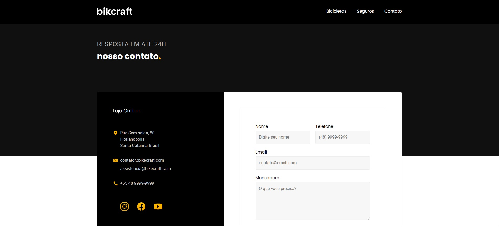
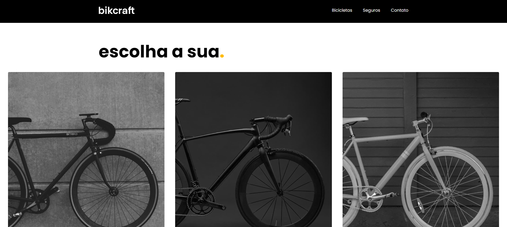
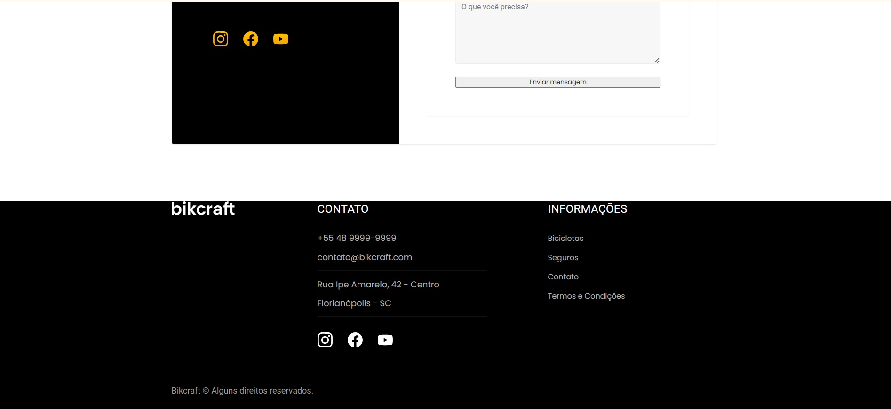

# Clone Loja de Bicicleta

Clone pagína https://www.origamid.com/projetos/bikcraft/contato.html

### Exercício curso Futuro DEV, semana 06, módulo 2

## Tecnologia ultilizadas

Reacte, Vite

## Como rodar o projeto

#### Clone este repositório em sua máquina local:

git clone https://github.com/FernandaBarrosLinhares/CloneLojaBike.git

npm insttall
npm dev run

## Melhorias

Criação de rotas
Uso do useState

## Desenvolvedora

- Fernanda Linhares (https://www.linkedin.com/in/fernanda-linhares-b10ba32b/)

- Natalia Cagnani (https://github.com/naty-c)

